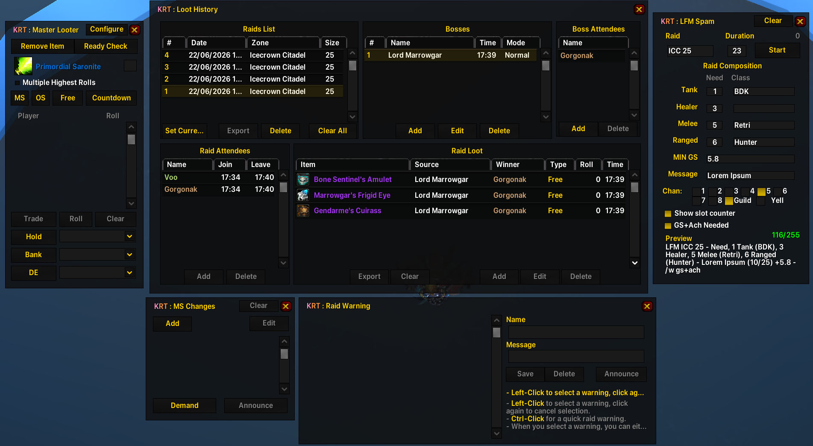

# KRT: Kader Raid Tools (BlackHill7 Fork)

AddOn Version: **0.5.6b**
Game Version: **3.3.5a**

Original by [Kader Bouyakoub](https://github.com/bkader) | Fork & new features by [BlackHill7](https://github.com/BlackHill7/KRT)

---

## What's New in This Fork

### GearScore Support in LFM Spammer
- New **MinGS** input field to set a minimum GearScore requirement
- **"Show Slots"** toggle to show/hide the raid slot counter
- **"GS+Ach Needed"** toggle appends `+GS - /w gs+ach` to your LFM message
- Slot counter now supports **5-man dungeons**
- Raid name field accepts up to **30 characters** (was 15)
- Preview shows **error message** in red when needed roles exceed raid size

### Highest Roll / Count Mode
New toggle in the Master Loot window:
- **On (Default):** Awards the highest roll to one winner at a time
- **Off (Count Mode):** Awards items by count (e.g., "x5") — one winner per item

### Split-Item Trading
Awarding partial stacks (e.g., 3 of 10 gems) now works automatically:
- Auto-splits the correct count from your bags
- Defers placement until the trade window opens
- Handles fallback if the saved bag slot is empty
- No more `ignoreStacks` option needed — stack handling is fully automatic

### Global MS Changes
Spec changes now persist **globally across all raids** instead of per-raid:
- Players type their MS changes in **raid chat** (no more whispering the leader)
- **Class-based spec picker** dropdown for quick assignment
- **Shift-click or left-click** a player name in chat to auto-fill the input
- Rapid-fire entry mode — saving stays in add mode for quick multi-entry
- Context-sensitive Edit button (Cancel / Save / Edit)

### Clear All Raid History
New **"Clear All"** button in the Logger — bulk-deletes all past raid history with a confirmation dialog. The current active raid is always preserved.

### Copyable Links in About Section
GitHub and Discord links in the config panel are now clickable input fields. Click any link to auto-select it for easy Ctrl+C copying.

### Hide All UI
- Type `/krt hide` to hide all game UI except KRT frames
- A **"Show UI"** button appears at the top-left corner to restore everything
- Perfect for clean screenshots during raids

### Boss Detection Overhaul
- Expanded boss NPC ID database from ~50 to **260+ entries** covering all WotLK raids
- **Live boss frame GUID caching** — detects bosses via unit frames, not just combat log
- Dual detection path: NPC ID lookup + boss frame scanning
- Boss frames cache on combat enter
- Boss list auto-refreshes after each kill

### Bug Fixes
- Nil guard on raid roster info (disconnected players)
- Log function nil-safety when no raid is active
- Stale roll data cleared when switching items or adding new items
- Manual winners protected from auto-roll override
- Item count clamped to minimum 1
- Raid warning announcements respect the `useRaidWarning` option
- Loot whispers gated behind the `lootWhispers` option
- LFM pause/resume timing fixed (pauses instead of stopping)
- French localization typo fixed ("bar" to "par")
- Config panel uses relative anchoring — layout adapts when frame height changes
- Edit button in MS Changes shows "Cancel" / "Save" / "Edit" based on context
- Preview character counter updates in real-time

---

## Slash Commands

| Command | Description |
|---|---|
| `/krt` or `/krt show` | Toggle Master Loot window |
| `/krt config` | Open configuration |
| `/krt lfm` | Toggle LFM Spammer |
| `/krt rw` | Toggle Raid Warnings |
| `/krt ms` | Toggle MS Changes |
| `/krt log` | Toggle Loot Logger |
| `/krt ach <text>` | Search achievement ID by name |
| `/krt hide` | Hide all UI except KRT (click "Show UI" to restore) |

---

## Installation

### KRT (Required)
1. Download or clone this repository
2. Place the `!KRT` folder into `World of Warcraft/Interface/AddOns/`
3. Restart WoW or type `/reload`

### ElvUI Skin (Optional)
If you use ElvUI + AddOnSkins and want KRT to match your UI theme:
1. Copy `ElvUI_Skin/KRT.lua` into your `ElvUI_AddOnSkins/Skins/Addons/` folder
2. Type `/reload` in-game
3. In ElvUI settings, go to **AddOnSkins** → enable **KRT**

> **Note:** This only works if you already have [ElvUI](https://github.com/ElvUI-WotLK/ElvUI) and [AddOnSkins](https://github.com/ElvUI-WotLK/ElvUI_AddOnSkins) installed.

---

## Credits

- **Kader Bouyakoub** — Original KRT author ([github.com/bkader](https://github.com/bkader))
- **BlackHill7** — New features, bug fixes & ElvUI skin ([github.com/BlackHill7](https://github.com/BlackHill7))

## Links

- GitHub: https://github.com/BlackHill7/KRT
- Discord: https://discord.gg/a8z5CyS3eW
- Original: https://github.com/bkader/KRT
